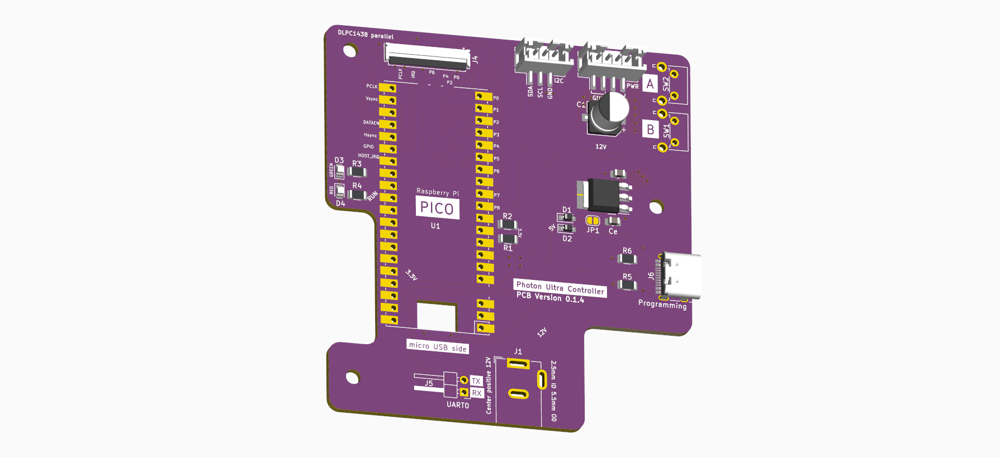
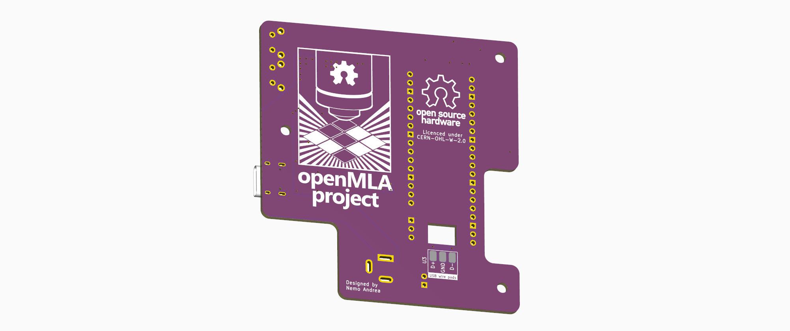

### PCB design

The design uses a Raspberry pi Pico W. A non-wireless version can also work but some of the scripts are to be built around wireless connectivity for data transfer. See the schematic (below and [as a pdf](schematic.pdf)) for more info.

### Assembly

Most components are SMD, and the mouser links can be found in the basic [BOM](BOM.csv). In addition to the components of the BOM, you will also need some small wires to connect the USB data lines.

A solderpaste stencil might be worthwhile, as that FPC connector is pretty challenging (but not impossible) to handsolder.

