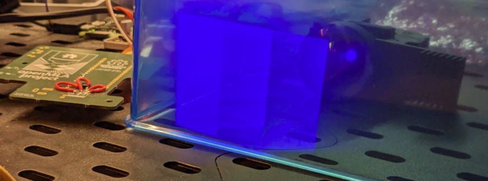
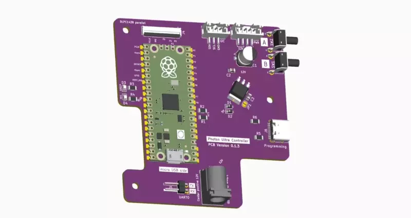

> **Important**
> This project is functional, but there is still some polishing to do. Instructions are also barebones. Get in touch if you need help.

# Photon Ultra DLP controller

This repository contains PCB design files and code for a replacement mainboard for the [Anycubic Photon Ultra](https://www.anycubic.com/pages/anycubic-photon-ultra). 

The replacement board allows users to generate the signals required for the *DLP controller board* (designed by eViewTek) & DMD that comes with the photon ultra. It does not capture the full functionality of the Anycubic mainboard as it does not control the interface LCD, control the mechanics (stepper motor) or run any resin 3D printer slicer software. It **only** controls the DLP projector with an arbitrary 2-bit* 1240x720 image. Exposure time can be set per image.

This project might be of interest to you if you **own a photon ultra** and are interested in either

1. Using the photon ultra for PCB fabrication (use the DLP to expose a photoresist)
2. Are looking to use a DMD for other applications but are not ready to build your own controller board.

If you are interested in learning more about the Photon Ultra, you can find more information on [this photon ultra teardown blog post](https://nemoandrea.github.io/blog/Anycubic_DLP_teardown/). More images are available on request.

> If you have another board that uses the DMD chipset (e.g. Anycubic D2 or Mars 4 DLP), you can probably modify the project with minimal effort and get it to work for those boards too! (you would have to maybe have to adjust the traces to the FPC, and maybe tweak the physical connectors etc; but code and approach would be very similar)

### 💡 UV Patterns

> [!NOTE]  
> Due to RAM limitations (and my c programming skill limitations) the board can only display 2-bit images if you use the full resolution of the DMD. More RAM would solve this issue.

Below an example of the eViewTek board and optical engine controlled by the pico pio units, showing the OpenMLA project logo. Note that the pattern is 2-bit, so there are only 4 intensities (of which 1 is OFF).

Below another example of the 4 grayscale values that can be shown.

### PCB

The PCB uses a Raspberry Pi Pico board as the central controller. The PIO blocks of the RP2040 generate the timing signals for the DLPC1438 chip on the DLP controller board.

### Using the board

The board is shaped to fit in the original mainboard space. The buttons, usb-c programming port and barrel jack are all accessible through the original Photon Ultra enclosure. This means you can use the original fittings, and everything in terms of cables should just fit.

Of course if you do not plan on using the DMD in the context of the photon ultra, you could easily redesign the board to be much more compact.

### Code

The code for this project is written in C, and unfortunately I am not a C programmer so it is very sloppy code. If you know of ways to make parts more elegant don't hesitate to make a pull request with changes.

More important than the code is the approach taken to power up and control the photon board, and more specifically the DLPC1438. A walkthrough of steps and gotchas can be found in [the guidelines](Guidelines.md). Most of it will also be mentioned in the code for the project, but having a separate document is more convenient.

The PIO implementation is a modified version of the nice [writeup by Hunter Adams](https://vanhunteradams.com/Pico/VGA/VGA.html#Code-organization).

To convert images for display, there is a simple python utility that converts a grayscale image into the right byte format for display. You can run it on the demo images to verify assembly.

### Context

This work was developed as part of the [openMLA project](https://github.com/openMLA), where the goal is to build an open hardware lithography system. Eventually an open hardware DLP controller board will be published as part of openMLA, but this represents an intermediate step. 

### Project TODO

* ✅ Establish I2C communication with DLPC1438 

* ✅ Verify UCB programming and linear regulator

* ❓ Verify 12V power delivery to board (should be fine as of version 0.1.4)

* ✅ Verify 51-pin connector and pinout is correct

* ✅ Verify (2-bit) images can be sent and projected

* ❓ Implement SPI interface for transferring images to the pico

* ❓ Minimise flickering

  

## Acknowledgements

The following KiCAD external libraries were used

* [Raspberry pi pico by ncarandini](https://github.com/ncarandini/KiCad-RP-Pico)
