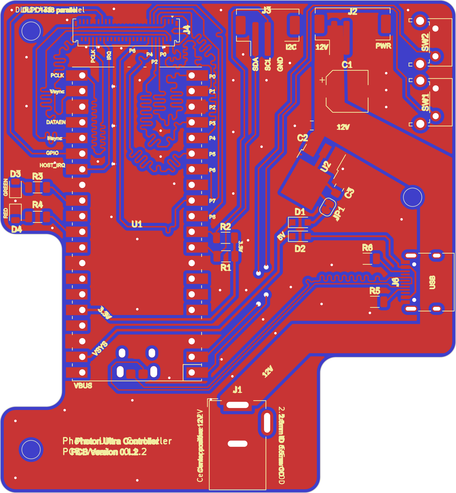

> **warning**
>
> The project is still under development, and is therefore not quite ready for independent replication. If want to use is asap, please get in touch so I can give pointers. Once the PCB has been assembled and minimal functional code is available a full guide will be written up.

# Photon Ultra DLP controller

This repository contains PCB design files and code for a replacement mainboard for the [Anycubic Photon Ultra](https://www.anycubic.com/pages/anycubic-photon-ultra). 

The replacement board allows users to generate the signals required for the DLP controller board & DMD that comes with the photon ultra. It does not capture the full functionality of the Anycubic mainboard as it does not control the interface LCD, control the mechanics (stepper motor) or run any resin 3D printer slicer software. It **only** controls the DLP projector with an arbitrary 8-bit 1240x720 image. Exposure time can be set per image.

This project might be of interest to you if you **own a photon ultra** and are interested in either

1. Using the photon ultra for PCB fabrication (use the DLP to expose a photoresist)
2. Are looking to use a DMD for other applications but are not ready to build your own controller board.

If you are interested in learning more about the Photon Ultra, you can find more information on [this photon ultra teardown blog post](https://nemoandrea.github.io/blog/Anycubic_DLP_teardown/). More images are available on request.

> If you have another board that uses the DMD chipset (e.g. Anycubic D2 or Mars 4 DLP), you can probably modify the project with minimal effort and get it to work for those boards too! (you would have to maybe have to adjust the traces to the FPC, and maybe tweak the physical connectors etc; but code and approach would be very similar)

### PCB

The PCB uses a Raspberry Pi Pico board as the central controller. The PIO blocks of the RP2040 generate the timing signals for the DLPC1438 chip on the DLP controller board.

### Code

The PIO implementation was heavily inspired by the nice [writeup by Hunter Adams](https://vanhunteradams.com/Pico/VGA/VGA.html#Code-organization).

### Context

This work was developed as part of the [openMLA project](https://github.com/openMLA), where the goal is to build an open hardware lithography system. Eventually an open hardware DLP controller board will be published as part of openMLA, but this represents an intermediate step. 

### Project TODO

* Write some convenience functions around buttons and image format
*  Implement some kind of basic webserver that Pico W can connect to for easy display

## Acknowledgements

The following KiCAD external libraries were used

* [Raspberry pi pico by ncarandini](https://github.com/ncarandini/KiCad-RP-Pico)